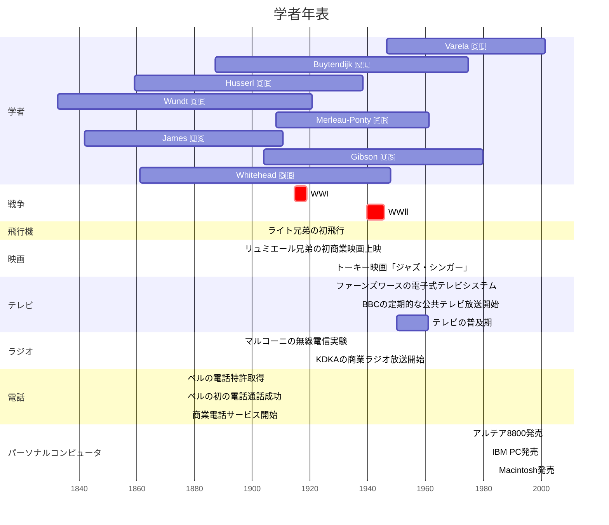

APA引用スタイルを日本語にも適用してつかう

APAスタイルに対応した'.bst'を手にいいれる（apacite.bst）

APAのそれを、日本語用へとカスタマイズしていく

3. LaTeX文書の設定

TODO:
・ソースコードの見た目の設定
・参考文献一覧の、.bstをいじって、日本語和訳本などの、原典情報を記せるようにする

「生の体験から作り出す」ときに、AからのBというだけでじゅうぶんか？そうではない。CからのBという感じがよいだろう。Cは「言葉」にはなりにくく、自覚しにくいものごとである。
　感性が磨かれる、スキルが熟達する、ということを、以下の段階とみなしてみると面白い。一人称的な体験の構図が、
A：「純粋無垢な世界 vs 自己」という互いに独立した二元で捉える構図・・・事実記述的
B：「世界と私の関係性」という関係論構図・・・解釈記述的
C：世界すなわち私　という構図・・・経験・妄想記述的
世界が、あらかじめ表情的にリッチに、自覚的に感得される。そのように描くことができるということが、感性開拓と密に連関している。ここ
　
意味をつくりだす「源」になっているのは身体の感覚・体験である。
現場に降り立って「実践」する必要がある。実践すると、身体を礎にした体験が生じる。体験は「身体で感じられる次元」がある。感じられる次元は、冒頭に述べたような「意味内容」に還元されるものではない。意味と聞くと、単なる「〜について」という様式で表せる「情報」のことだと思うかもしれないが、そうではない。なぜ情報とみなすべきではないのか？私たちは意味内容でこの次元を覆い隠しがちだろうが、それは主観/客観という二元構図が私たちに根付いているせいでもあろう。醸成過程は”How”と呼ぼう。意味が身体を礎に成り立っているということは、メルロ=ポンティやカッシーラーをはじめ、現象学において20世紀初頭から論じられてきたことでもある。だが、現象学的に「机上で論じる」だけでも不十分なのである。実践は、机上でも実験室でもなく「現場」において遂行される。身体知研究には、感じられる次元が源にした、”How”たる意味の醸成過程をあつかう実践研究が必要である。
　情報の最たる例は、知能研究でいう表象主義的な情報処理モデルだろう。あらかじめ主体の内部に情報が知識として格納されており、それを外界からやってくる情報と対応づけて処理することで、知的なふるまうのだと。よくよく定義され閉ざされた世界のなかでならまだしも、いざ日常的な汎用世界に放り出されると、とたんに太刀打ちできなくなる。日常世界はめまぐるしく変化し、予測不可能である。そんな世界に対し、有限な内部知識のなにをどう対応づければよいのか？結局、Whatは、生きるひとが日常で何気なくやってのけるふるまい・営みが表現できないのである（フレーム問題）。それは意味を表象主義的に情報として扱うことの限界である。これらはWhatと言え、それだけでは意味にならない。
　ここに足りないのは「身体」である。1980年代以降の知能科学・認知科学でも、この主張と符号する研究は多く蓄積されてきている。生態心理学やDSA、身体化などである。これらの研究群は、身体があってはじめて、脳・身体・環境とのたえまない流れが生まれ、知とはその全体の流れにこそ宿り・発現するものであることを実証してきた。本研究はこうした研究群のうえに成り立つものである。だが、これらの研究は身体が知を成り立たせる「しくみ」を明らかにしえたとしても、身体知そのものの描写とは言えまい。あくまで身体知は「意味」なのである。この指摘は突き詰めるならば「脳神経系の物質的相互作用（量）をいくら精密に記述しようが『痛み』そのもの（質）は描けない」といった問題（意識のハードプロブレム）にも帰しうるものだ。これらの研究が堅く守られた「実験室」において遂行される事実も念頭においてほしい。
　身体運動実践家は日々、身体を礎に、よりよい身体・心・環境との関係性を樹立しようと、みずからの「身体」を研ぎ澄ましている。現場の行為者として、一人称視点からそのありかたを探究しているのである。この意味で、身体運動実践家の学びは、身体知研究のとても良い例題であると考える。身体知を探究するには、実践家の一人称視点から体験からいかに意味が醸成されるのかを、一人称視点から丹念に描くという方法論なのである。それには、研究者が現場に降り立ち、みずから体験したり実践者のそばに寄り添いながら、探究をすすめることが重要である。
　現場において、体験から意味を醸成せんとする過程を描くこと、それすなわち、本人の「一人称視点からのみえ」をつまびらかに描くことが必要である。

身体知ということばは、「頭知」と対比的に考えるのが早いだろう。頭知とは知を「主体の内部にあらかじめ格納されている」ものとして捉える考え方である。意味内容Xに「ついての」という様式で記述可能なものであり、知を、それぞれのひとの所有物（What）のようにみなす。およそ、この考え方はいまだに私たちに常識として根付いてしまっているというのは本研究のひとつの問題意識である。この考え方の祖にデカルトを位置づけることができるだろうが、知能科学の歴史でみるならば、この考え方は80’sまでの表象主義的な情報処理モデルに結実したと言える。
　ところが、表象主義的情報処理モデルは、汎用知能をめざす過程で大きな壁にぶちあたった。予測不可能に動き続けている日常の世界に直面すると、このモデルはあまりに無力なのだ。「あらかじめ知識表現を有限個もっておく」というのは知識を「固定された枠」とみなすことにほかならない。そうであるかぎり、「揺れ動く環境状況のうちなにがどうその枠に収まるのか」を判断できない。結果、「創造的に」ふるまうことができない。枠を動的に拡張・縮小できればよいのだが、そのフレーム伸縮条件そのものもまたひとつの枠とみなせるのだから、けっきょく同じ問題に陥る。俗に言うフレーム問題である。このように、What的な頭知は、私たち生身のひとの生きるクリエイティブな知性表現しきれないのである。
　これに対し、近年の知能学や認知科学の領域では、「身体ありきの知」を示すさまざまな研究群が蓄積されてきている。たとえば身体性認知、道具の身体化などである。生成系AIに代表されるNNモデルは「知識を明示的に持っておく」という従来の表象主義的モデルは打破しているが、まだ現時点では、システムへの入力ノードということを考えると、足りない。身体性モデルでは、知は、脳神経系をふくむ肉体と環境のインタラクション全体から現れ出るものだとする。たとえば、ーー。またまるまるの事例では、ーーという身体の役割が示される。
　身体知はこれらの身体性を重視した知能モデルのうえに立てられる概念ではあるが、知が成り立つしくみ・条件を記述するだけでは、それは身体知の研究になりきらない。この主張は究極的には、意識のハードプロブレムと同じである。「脳神経系の物質現象をいくら精密に記述しても、痛みそのものは描けない」ということだ。身体知とは、こういう質・身体的実感をともなった「意味」のことである。
　私たちが生き、学び、感じ、みえるその生の体験そのものは、描くことができないからである。ところが、いくら肉体の機械的な運動の物理を記述したり、神経系の電気的・化学的な現象を記述したところで、私たち一人称的なみえそのものは描けない。これらの研究群は、いわば一人称的なみえを成り立たせる「しくみ」にすぎない。この点で心脳問題をかすめているが、そう、本研究は、心の哲学でいうところの「二元論」に立つのだ（実体二元論なのか性質二元論なのかの違いは細かくは問わない）。しくみがはたらいていることは疑わないが、それに随伴するのかなんだか、少なくとも、「心」すなわち、一人称的な経験があることを認めている。つまり、一人称的な経験そのものを描かなくてはならない。質は遼に還元できない。
なのか性質いだが、身体ちが成り立つしくみを量的にいくら精密に記述しようが、意識現象としての身体知そのものには迫れない。
　身体運動の実践家にとって重要なのは、頭知（情報）を、身体知へと醸成する。そのために日々、運動・感覚・思考それぞれの認知的はたらきを研ぎ澄ましている。
　はたしてどのような研究パラダイムでやるのがよいのか？いったい、身体知の研究はどのようにやるのがよいのか？そのひとつの解を提供することも、本研究のねらいである。
